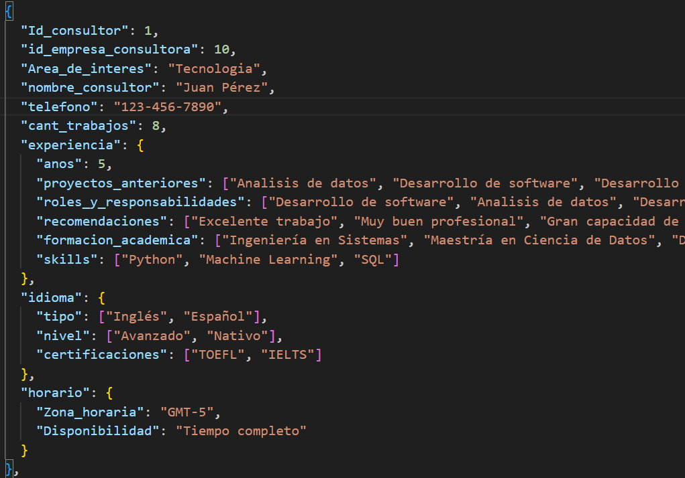
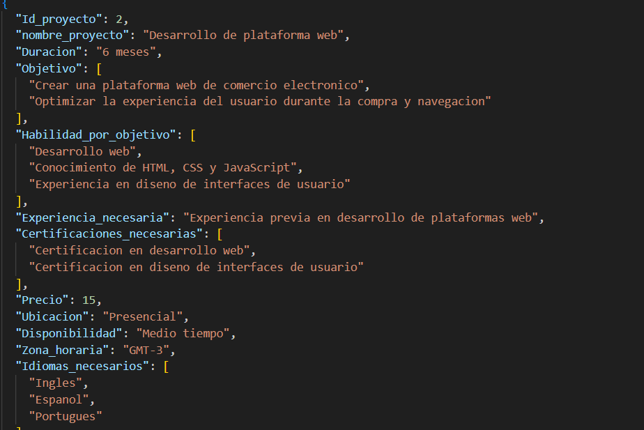
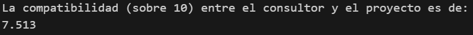
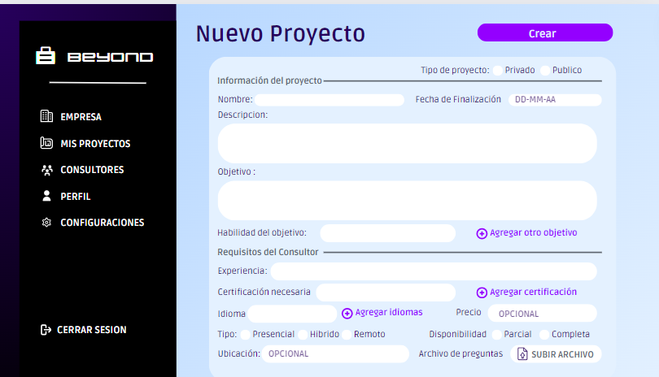
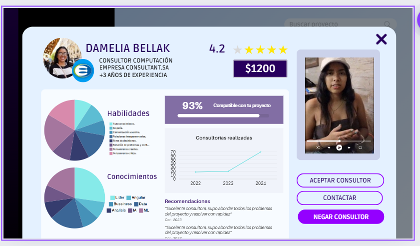

# BeyondIA
# Sistema de Análisis de Compatibilidad Consultor-Proyecto

¡Bienvenido al Sistema de Análisis de Compatibilidad entre un Consultor y un Proyecto!

Este sistema te permite evaluar la compatibilidad entre un consultor y un proyecto basado en una serie de criterios establecidos.

Se brinda una nota adicional para recordar al usuario que se deben tener en cuenta los archivos JSON de consultores y proyectos en donde se encuentran con el ID respectivo. A nivel posterior, dicho archivo vendr'ia de una Base de Datos y se realizaría un Query. 

Confiamos fielmente que las explicaciones son mejores mediante diagramas, por lo que adjuntamos el link de Lucid en el que plasmamos y organizamos todas nuestras ideas.

**Lógica en diagrama:** [Link a Lucidchart](https://lucid.app/lucidchart/e94b4673-a4d1-4027-8a94-a8a863f0725a/edit?viewport_loc=-6623%2C-519%2C13921%2C5673%2C0_0&invitationId=inv_f0e9ee2d-c56c-49ac-90e6-3a9dbdb6f66b)


## Ejemplos de desarrollo en consola (Desarrollo del aplicativo en proceso)

1. `IDCONSULTOR` = 1 y `IDPROYECTO` = 2
La información del consultor se encuentra en consultores.json


La información del proyecto se encuentra en proyectos.json


2. La compatibilidad entre el consultor con ID = 1 y el proyecto con ID = 2 es sobre 10:


## Pasos para Ejecutar

(CONSIDERACIÓN: Por la cantidad de peticiones, de vez en cuando los prompts no devuelven lo solicitado, por lo que la respuesta será NaN. Hay que tener un tiempo entre petición de alrededor de 1min.)

1. Abre el archivo `IA/run.js` en tu editor de código.
2. Localiza las variables `IDCONSULTOR` e `IDPROYECTO` en el código.
3. Reemplaza `IDCONSULTOR` y `IDPROYECTO` con los IDs correspondientes del consultor y el proyecto que deseas evaluar.
4. Guarda los cambios en el archivo.
5. Abre una terminal en la carpeta donde se encuentra el archivo `run.js`.
6. Ejecuta el siguiente comando para iniciar el sistema:

```bash
node run.js
```

## Ejemplos de flujo de pantallas en el prototipo (Desarrollo del aplicativo en proceso)
Un flujo de pantalla efectivo permite el ingreso de los datos necesarios para obtener un nivel de compatibilidad confiable. Así como la importancia de la presenetación de dicha información.






